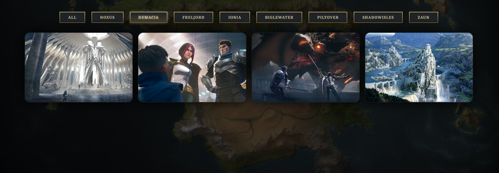

# RuneterraFilterRegion

Hello there,

Here is the **League-Of-Legends-RegionOfRuneterra-Filter**.

This project was realised with ```Create React App```.

In a first time we have a **slider** with different images of the world of **runeterra**.

Then we have the **icons** of each **faction** of the world of **runeterra**, where we can **click** on it to make **appear** a **modal window** with the **history** of each faction of this **incredible** world.

Further down the page we have a **gallery of images** that we can **filter** by clicking on the **button** of the desired **faction**.

A filter **animation** of the images is made with the library ```framer motion```.

The design of this page is realized with :

* HTML
* CSS
* JavaScript
* React Js

the design is inspired by the site **loluniverse**.

## Requirements

* npx create-react-app (your app)
* cd (your app)
* npm start
    Runs the app in the development mode.
    Open http://localhost:3000 to view it in the browser.

## Down below images of the slider as well as the factions represented with their respective logo.

## Down below images of the modal window with the history of the faction.


## Down below images of the image galleries with their buttons to be able to sort them by faction.


## By clicking on the faction Demacia or Zaun the images of the respective factions are now sorted.




